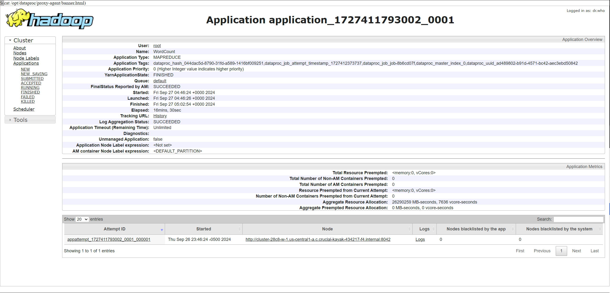
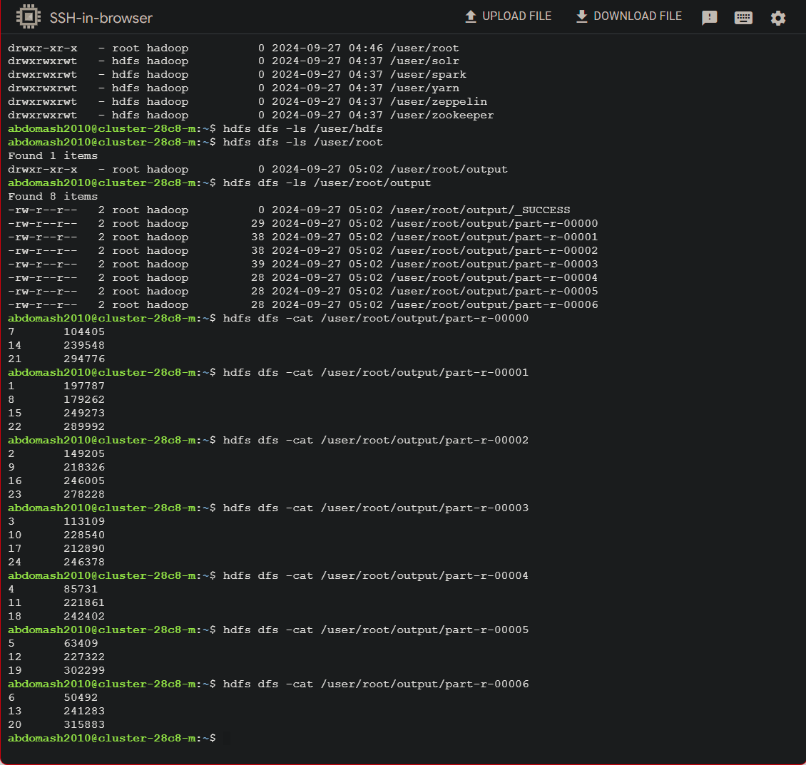
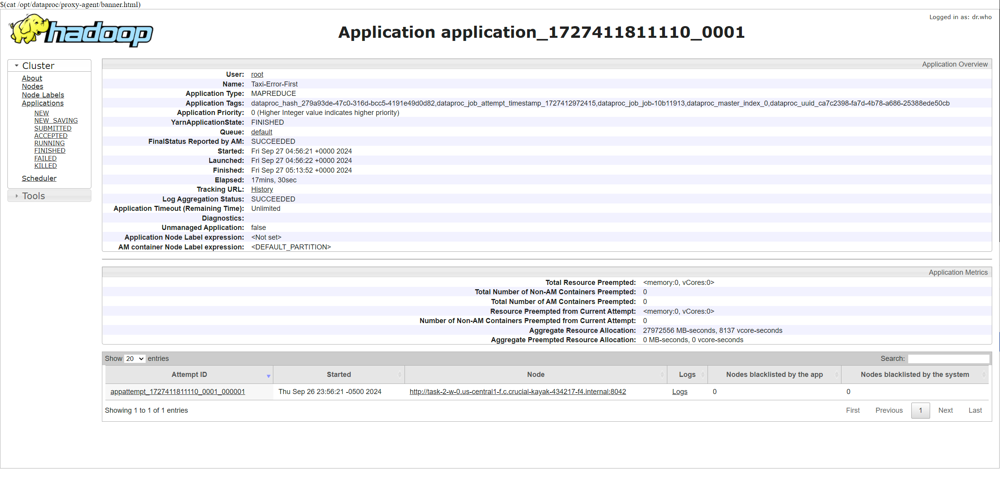
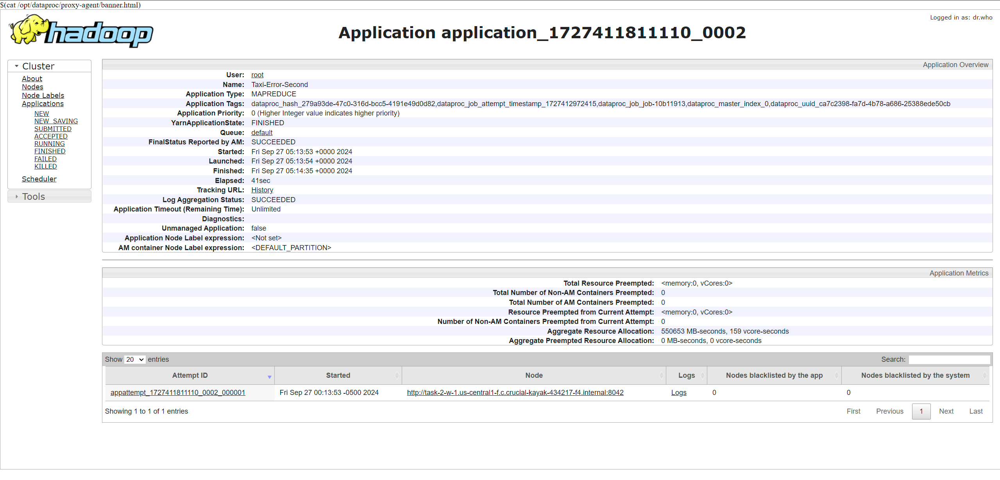
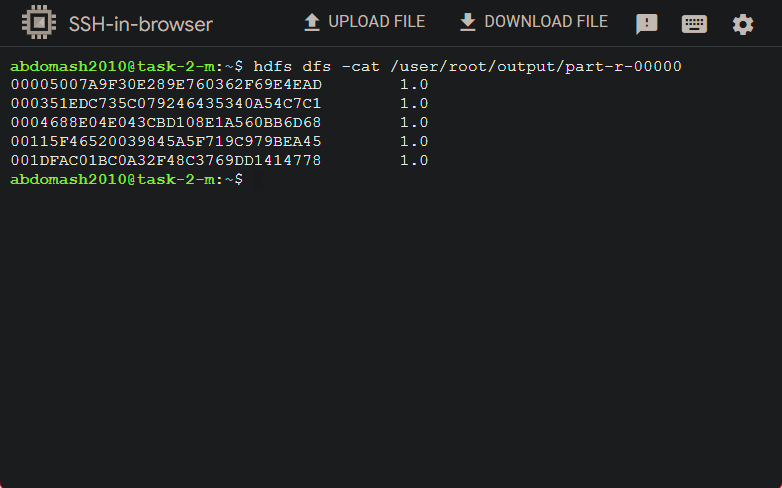
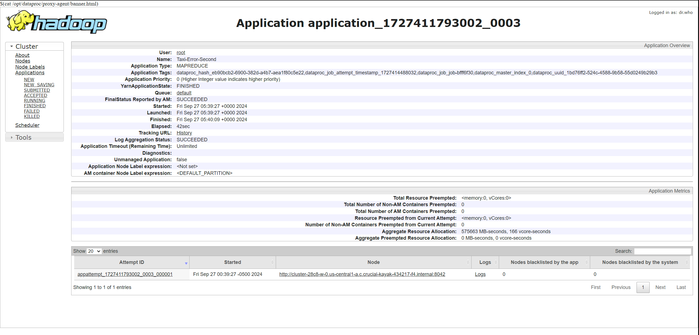

# Author

**Abdulrahman Alshahrani**

**_(UT EID: ama8347)_**

# Course

**_CS378 - Cloud Computing_**

**_Unique Number: 51515_**

# Report

## Task 1:

The code for this task can be found in the `task-1` branch in my code repo.

Here are the results (and can also be found in `task-1-results.txt`):
(I sorted these lines manually)

```
1       197787
2       149205
3       113109
4       85731
5       63409
6       50492
7       104405
8       179262
9       218326
10      228540
11      221861
12      227322
13      241283
14      239548
15      249273
16      246005
17      212890
18      242402
19      302299
20      315883
21      294776
22      289992
23      278228
24      246378
```

## Task 2:

The code for this task can be seen in the `task-2` branch.

Here are the results (and can also be found in `task-2-results.txt`):

```
00005007A9F30E289E760362F69E4EAD	1.0
0004688E04E043CBD108E1A560BB6D68	1.0
001D3B86C2ACDEE4D1B98AFE52969F3D	1.0
010CFFF37C390AB7DB196B83DB225BB8	1.0
04D0035791B61BF046D0263EBA5EE34C	1.0
```

## Task 3:

The code for this taks can be seen in the `task3` branch.

Here are the results (and can also be found in `task-3-results.txt`):

```
28EAF0C54680C6998F0F2196F2DA2E21	179.99998
42AB6BEE456B102C1CF8D9D8E71E845A	191.55
74071A673307CA7459BCF75FBD024E09	209.99998
95A921A9908727D4DC03B5D25A4B0F62	210.0
A7C9E60EEE31E4ADC387392D37CD06B8	1260.0
D8E90D724DBD98495C1F41D125ED029A	630.0
E79402C516CEF1A6BB6F526A142597D4	144.54546
E9DA1D289A7E321CC179C51C0C526A73	231.29999
FA587EC2731AAB9F2952622E89088D4B	179.99998
FD2AE1C5F9F5FBE73A6D6D3D33270571	4094.9998
```

## Screenshots

### Task 1




### Task 2





### Task 3




# Project Template

# Running on Laptop

Prerequisite:

- Maven 3

- JDK 1.6 or higher

- (If working with eclipse) Eclipse with m2eclipse plugin installed

The java main class is:

edu.cs.utexas.HadoopEx.WordCount

Input file: Book-Tiny.txt

Specify your own Output directory like

# Running:

## Create a JAR Using Maven

To compile the project and create a single jar file with all dependencies:
`	mvn clean package `

## Run your application

Inside your shell with Hadoop

Running as Java Application:

`java -jar target/MapReduce-WordCount-example-0.1-SNAPSHOT-jar-with-dependencies.jar SOME-Text-Fiel.txt  output`

Or has hadoop application

`hadoop jar your-hadoop-application.jar edu.cs.utexas.HadoopEx.WordCount arg0 arg1 ... `

## Create a single JAR File from eclipse

Create a single gar file with eclipse

- File export -> export -> export as binary -> "Extract generated libraries into generated JAR"
